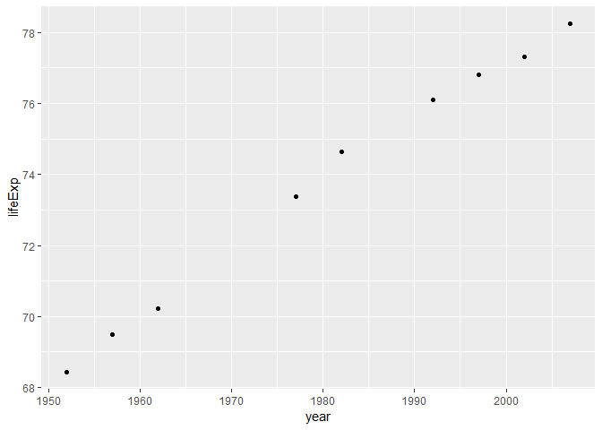
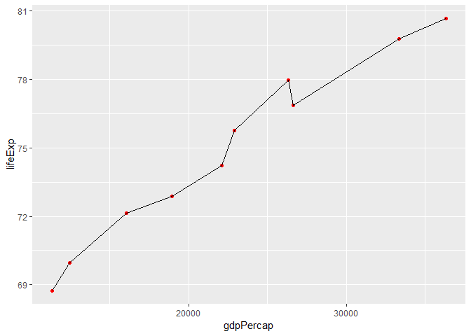
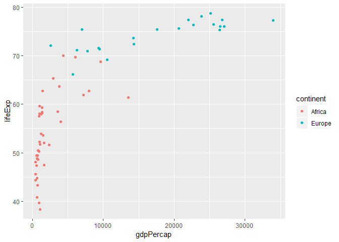
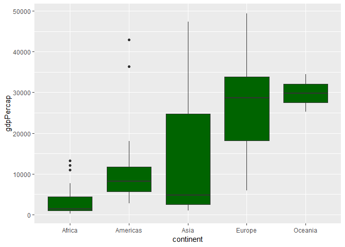

## Load packages


```r
library(tidyverse)
```

## Load data


```r
gap <- read_csv("https://bit.ly/gap_data")
```

## Exercises

### Exercise 1

Take a glimpse at the data set with function `glimpse()`.


```r
glimpse(gap)
```

```
## Observations: 1,363
## Variables: 6
## $ country   <chr> "United Kingdom", "Eritrea", "Trinidad and Tobago", ...
## $ continent <chr> "Europe", "Africa", "Americas", "Asia", "Asia", "Ame...
## $ year      <dbl> 1967, 2007, 1997, 2002, 2007, 1987, 1957, 1982, 1952...
## $ lifeExp   <dbl> 71.360, 58.040, 69.465, 76.990, 77.588, 65.205, 40.4...
## $ pop       <dbl> 54959000, 4906585, 1138101, 22454239, 2505559, 14293...
## $ gdpPercap <dbl> 14142.8509, 641.3695, 8792.5731, 23235.4233, 47306.9...
```

How many variables and observations are in `gap`? What are the variable types
for the variables in `gap`?

Variable | Type
---------|----------
Var 1    |
Var 2    |
Var 3    |
Var 4    |
Var 5    |
Var 6    |


### Exercise 2

#### Part 1


```r
gap %>% 
  filter(country == "United States") %>% 
  ggplot(mapping = aes(x = year, y = lifeExp)) +
  geom_point()
```

<!-- -->

#### Part 2


```r
gap %>% 
  filter(country == "Canada") %>% 
  ggplot(mapping = aes(x = gdpPercap, y = lifeExp)) +
  geom_point(color = "red") +
  geom_line()
```

<!-- -->

#### Part 3


```r
gap %>% 
  filter(continent == "Africa", year == 1992) %>% 
  ggplot(mapping = aes(x = gdpPercap, y = lifeExp)) +
  geom_point(color = "purple")
```

<!-- -->


### Exercise 3

#### Part 1


```r
gap %>% 
  filter(continent %in% c("Africa", "Europe"), year == 1992) %>% 
  ggplot(mapping = aes(x = gdpPercap, y = lifeExp, color = continent)) +
  geom_point()
```

<!-- -->

#### Part 2


```r
gap %>% 
  filter(year == 2007) %>% 
  ggplot(mapping = aes(x = continent, y = gdpPercap)) +
  geom_boxplot(fill = "darkgreen")
```

<!-- -->


